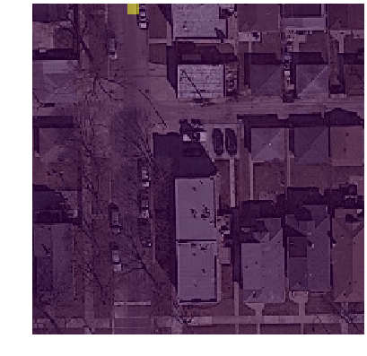
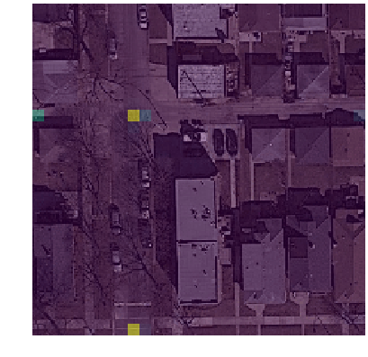
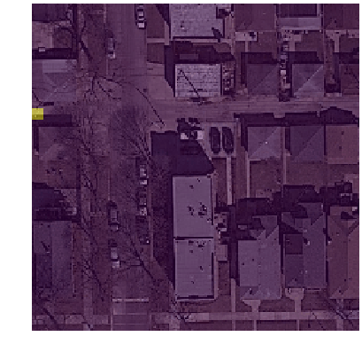
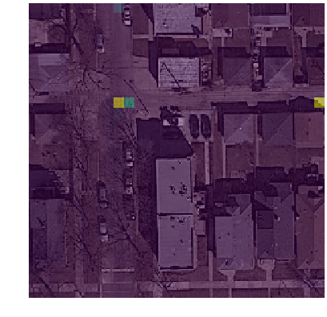
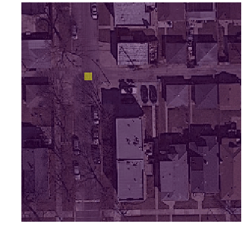
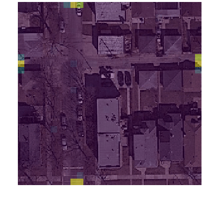
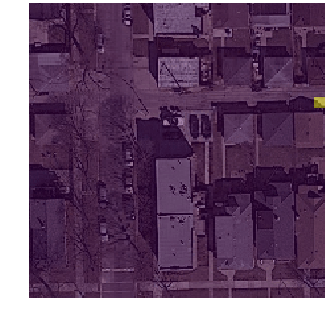

# Examples

### Example 1
| Mask Boundary | Mask Vertices | Peaks | Final Result |
|:--:|:--:|:--:|:--:|
|  |  |  |  |

| RNN *Input* | RNN *Output* | RNN *Input* | RNN *Output* |
|:--:|:--:|
|  |  |  |  |
|  |  |  |  |

### Example 2 (Failure Case)
| Mask Boundary | Mask Vertices | Peaks | Final Result |
|:--:|:--:|:--:|:--:|
|  |  |  |  |
